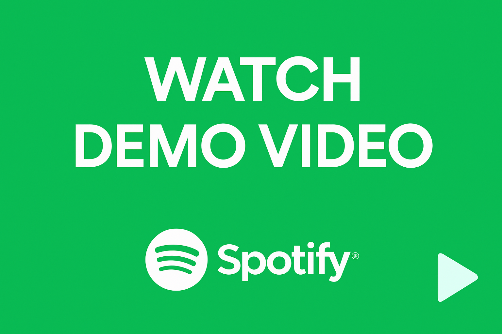

# 🎵 Android Spotify Streaming Bot – Private Automation System

 > **Closed-source, enterprise-grade Spotify bot** — an advanced Spotify automation and streaming bot for physical Android devices. Designed for music professionals, labels, and teams, it delivers human‑like playback, multi‑account rotation, artist targeting, and centralized control via a web dashboard.

---

## 🚀 Why Choose This Bot?
- **24/7 Streaming Automation:** 3 batches/day per device for continuous rotation.
- **Human‑Like Behavior:** Swipes, taps, scrolls, volume nudges, random waits.
- **Artist Targeting:** Filter by artist/playlist; supports Artist Radio flows.
- **Multi‑Account Scaling:** ~15 accounts/device using cloned, fingerprint‑spoofed apps.
- **Full Control:** Web dashboard to start/stop, configure rules, and view logs.

---

## ⚡ Features
- **Batch Scheduling:** 3×8h rotations (5 accounts per batch) with automatic hand‑off.
- **Session Persistence:** Stable login state and recovery after reboots.
- **Daily Stream Limits:** Per‑song/account caps; skip/ignore when cap reached.
- **Randomized Saves:** Configurable % to save tracks for natural patterns.
- **Artist Radio Filtering:** Prefer target artist via radio/search + heuristics.
- **Cloned Spotify APKs:** Unique app IDs and tuned fingerprints per instance.
- **Dashboard Management:** Configure behavior, monitor activity, export logs.
- **Notifications:** Optional Telegram/Discord alerts for status & errors.
- **Scale-Out:** Runs on physical Android phones (phone‑farm friendly).

> Built with a real‑device control engine and Android accessibility/UI automation; no emulator requirement.

---

## 🖼 Screens & Demo

  

- **Dashboard**  
  

- **Batch Scheduler**  
  

- **Architecture (High-Level)**  
  

**For Detailed Demo Watch This Video:**

**Part 1:**  
https://www.loom.com/share/ba19ddc5d0594c48a4321f0bf517227d?sid=4fe5594f-eecd-4209-ad2d-2588c42ccd2d  

**Part 2:**  
https://www.loom.com/share/788a03a5c2bf4044b96d54517a5915d1?sid=a9f598d5-3641-46bf-ba6f-145c9bb5f10f  

---

## 🔍 How It Works (High‑Level)
1. **Connect Devices & Accounts** — install device agent, add Spotify accounts.
2. **Set Behavior Rules** — artist filters, stream caps, save %, delays.
3. **Start Batches** — 3×8h rotation with automatic switching.
4. **Monitor & Adjust** — dashboard for status, logs, and quick edits.

> We prioritize conservative defaults: randomized delays, per‑account limits, and recovery flows.

---

## 🧰 Tech Overview
- **Platform:** Physical Android (8.0+). Phone‑farm compatible.
- **Control:** Web dashboard (backend API + React UI) with device agents.
- **Automation:** Android accessibility/UI automator & touch injection.
- **Data:** Local DB for sessions, counters, and scheduling metadata.
- **Integrations:** CSV/Sheets import; optional webhooks.

---

## 📦 Access & Onboarding
This is a **private binary** with guided onboarding. Contact us to discuss your use case:
- [Join Discord](https://discord.gg/vBu9huKBvy)
- [Message on Telegram](https://t.me/devpilot1)

> Pricing and license options are shared during a call based on scale and support needs.

---

## ❓ FAQ
**Is it open source?**  
No. This repo provides docs, visuals, and onboarding. Builds are distributed privately.

**How many accounts per device?**  
Designed for ~15 accounts/device (3 batches × 5 accounts). Configurable.

**Can it run 24/7?**  
Yes — via scheduled batch rotations and watchdog recovery.

**Is it safe?**  
We provide throttling, randomized behavior, and per‑account caps to reduce risk. You are responsible for complying with Spotify’s Terms of Service and applicable laws.

**Does it support multiple devices?**  
Yes — scale horizontally across as many Android phones as you provide.

---

## ⚖ Legal
See [TERMS](./TERMS.md) • [PRIVACY](./PRIVACY.md) • [DISCLAIMER](./DISCLAIMER.md) • [SECURITY](./SECURITY.md)

---

## 🗺 Roadmap (Public)
- Dashboard v2 (bulk presets, templates)
- Email/Slack notifications
- Enhanced audit logs & exports

---

## 📝 Changelog
We publish release notes under GitHub **Releases** and mirror key items in [CHANGELOG](./CHANGELOG.md).

---

## 📬 Contact
  
  

