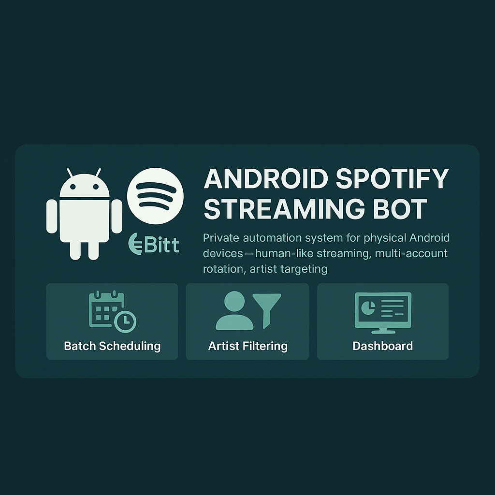
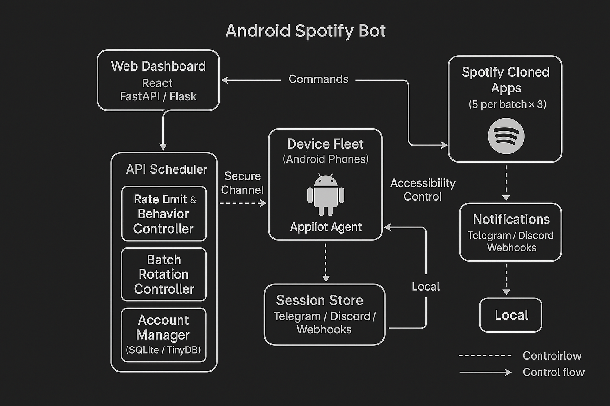
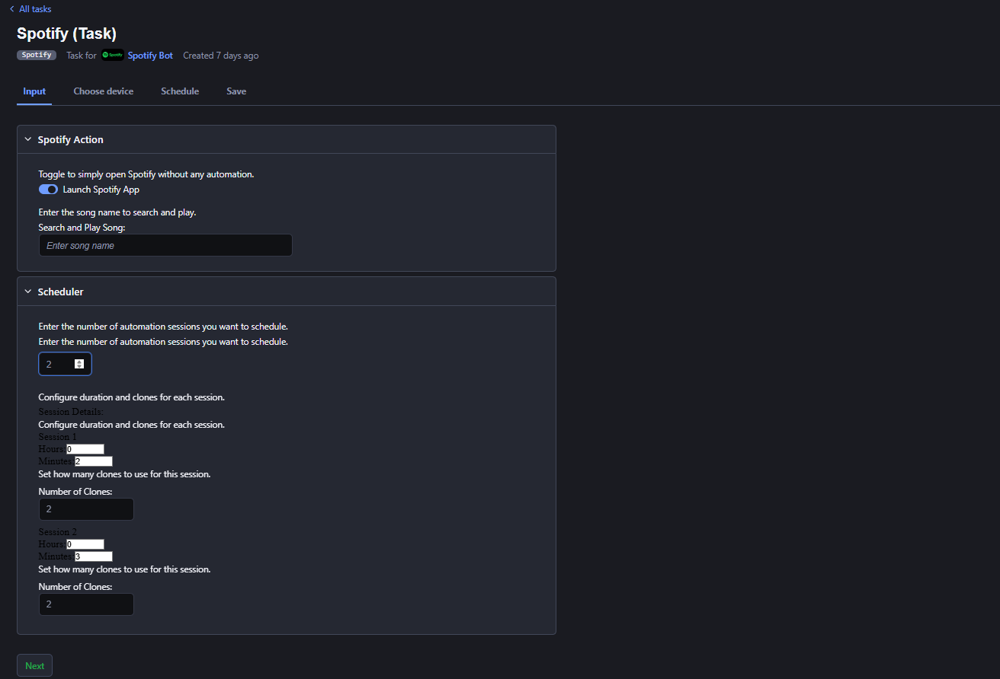

#  Android Spotify Streaming Bot – Private Automation System

 > **Closed-source, enterprise-grade Spotify bot** — an advanced Spotify automation and streaming bot for physical Android devices. Designed for music professionals, labels, and teams, it delivers human‑like playback, multi‑account rotation, artist targeting, and centralized control via a web dashboard.

---

##  Features
- **Batch Scheduling:** 3×8h rotations (5 accounts per batch) with automatic hand‑off.
- **Session Persistence:** Stable login state and recovery after reboots.
- **Daily Stream Limits:** Per‑song/account caps; skip/ignore when cap reached.
- **Randomized Saves:** Configurable % to save tracks for natural patterns.
- **Artist Radio Filtering:** Prefer target artist via radio/search + heuristics.
- **Cloned Spotify APKs:** Unique app IDs and tuned fingerprints per instance.
- **Dashboard Management:** Configure behavior, monitor activity, export logs.
- **Notifications:** Optional Telegram/Discord alerts for status & errors.
- **Scale-Out:** Runs on physical Android phones (phone‑farm friendly).

> Built with a real‑device control engine and Android accessibility/UI automation; no emulator requirement.

---

##  Screens & Demo

  

 ## Architecture (High-Level)
  

  
  

## Dashboard

  

## Batch Scheduler 
 

  
 

## 

  <strong>Watch a Short Video Demo</strong>

  

**For Detailed Demo Watch These Video:**

**Part 1:**  
https://www.loom.com/share/ba19ddc5d0594c48a4321f0bf517227d?sid=4fe5594f-eecd-4209-ad2d-2588c42ccd2d  

**Part 2:**  
https://www.loom.com/share/788a03a5c2bf4044b96d54517a5915d1?sid=a9f598d5-3641-46bf-ba6f-145c9bb5f10f  

---

##  Why Choose This Bot?
- **24/7 Streaming Automation:** 3 batches/day per device for continuous rotation.
- **Human‑Like Behavior:** Swipes, taps, scrolls, volume nudges, random waits.
- **Artist Targeting:** Filter by artist/playlist; supports Artist Radio flows.
- **Multi‑Account Scaling:** ~15 accounts/device using cloned, fingerprint‑spoofed apps.
- **Full Control:** Web dashboard to start/stop, configure rules, and view logs.
---

##  How It Works (High‑Level)
1. **Connect Devices & Accounts** — install device agent, add Spotify accounts.
2. **Set Behavior Rules** — artist filters, stream caps, save %, delays.
3. **Start Batches** — 3×8h rotation with automatic switching.
4. **Monitor & Adjust** — dashboard for status, logs, and quick edits.

> We prioritize conservative defaults: randomized delays, per‑account limits, and recovery flows.

---

##  Tech Overview
- **Platform:** Physical Android (8.0+). Phone‑farm compatible.
- **Control:** Web dashboard (backend API + React UI) with device agents.
- **Automation:** Android accessibility/UI automator & touch injection.
- **Data:** Local DB for sessions, counters, and scheduling metadata.
- **Integrations:** CSV/Sheets import; optional webhooks.

---

##  Access & Onboarding
This is a **private binary** with guided onboarding. Contact us to discuss your use case:
- [Join Discord](https://discord.gg/vBu9huKBvy)
- [Message on Telegram](https://t.me/devpilot1)

> Pricing and license options are shared during a call based on scale and support needs.

##  Contact
  
  

